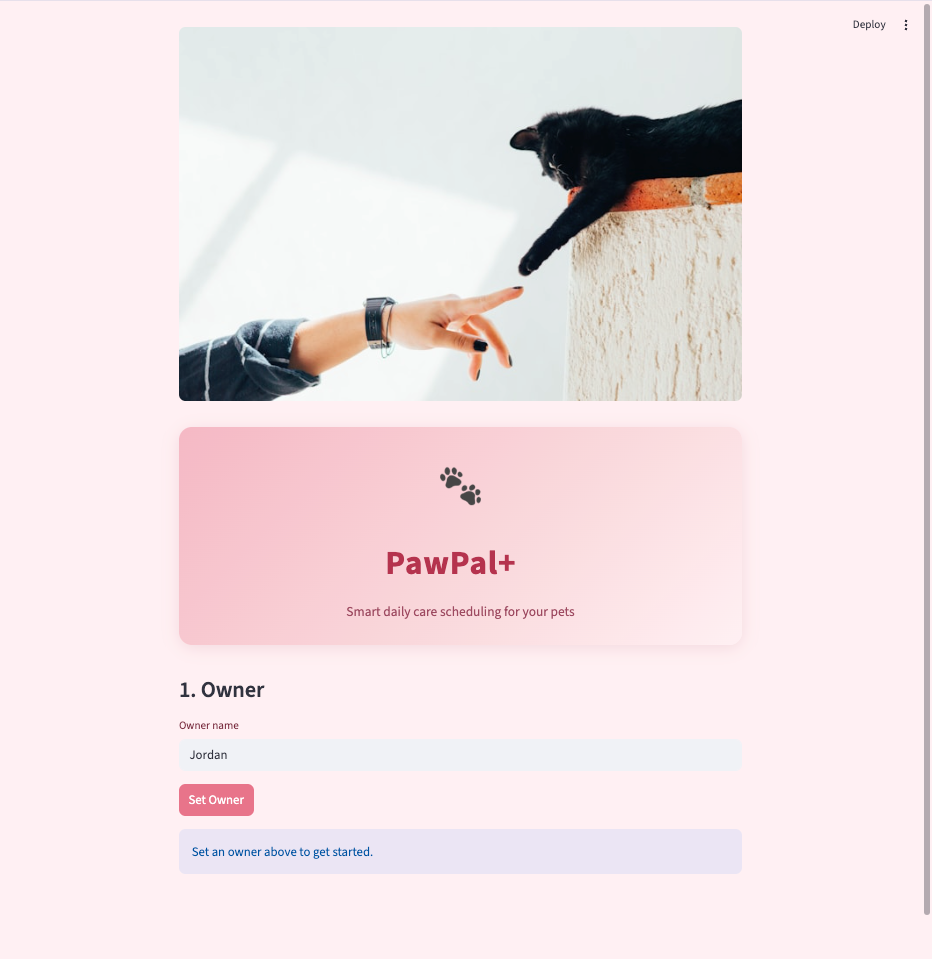

# PawPal+ (Module 2 Project)

**PawPal+** is a Streamlit app that helps a pet owner plan and track daily care tasks for their pets, with smart scheduling, conflict detection, and automatic recurring-task management.

---

## 📸 Demo

<a href="home.png" target="_blank"></a>

---

## Features

### Owner & Pet Management
- Create an owner profile and register multiple pets (name, species, age)
- Each pet maintains its own independent task list
- Pets and tasks are identified by unique integer IDs, preventing name-collision bugs

### Task Creation
- Add tasks with title, category, duration, priority (1–5), and optional preferred time (`HH:MM`)
- Set a task as **daily** or **weekly** recurring with a first due date — the app auto-generates the next occurrence when the task is completed
- Filter a pet's task list by status: All / Pending only / Done only

### Sorting by Time
- `sort_by_time()` converts each `"HH:MM"` string to total minutes since midnight and sorts ascending
- Tasks with no preferred time are placed at the end of the day (`23:59`) rather than the beginning
- The schedule view offers a toggle between **priority order** and **chronological order**

### Smart Filtering
- `filter_tasks(pet_name, completed, category)` accepts any combination of optional filters
- Multiple filters narrow the results (intersection, not union) — e.g. "Luna's pending tasks only"
- All string comparisons are case-insensitive

### Daily Schedule Generation
- `generate_daily_plan()` sorts by priority first, then uses preferred time as a tiebreaker
- Higher-priority tasks always appear before lower-priority tasks regardless of their scheduled time
- The schedule view can be filtered by pet so owners focus on one animal at a time

### Duration-Aware Conflict Detection
- `detect_conflicts()` computes each task's time window `[start, start + duration)` and flags any pair where the intervals overlap: `start_a < end_b AND start_b < end_a`
- Catches **partial overlaps** caused by task duration (e.g. a 07:45+30 min task runs into an 08:00 task) that a simple start-time comparison would miss
- Only pending tasks are checked — completed tasks cannot conflict
- `warn_conflicts()` returns plain-English warning strings; the UI surfaces each one as an `st.warning` callout so no conflict is hidden in a console log

### Recurring Task Automation
- `complete_and_reschedule(task_id)` marks the current occurrence done and auto-creates the next one using Python's `timedelta`:
  - `"daily"` → `due_date + timedelta(days=1)`
  - `"weekly"` → `due_date + timedelta(weeks=1)`
- The new task is added to both the scheduler's list and the pet's own task list so everything stays in sync

---

## System Architecture

The backend is organized into four classes in [`pawpal_system.py`](pawpal_system.py):

| Class | Responsibility |
|---|---|
| `Task` | Stores a single care activity — fields, recurrence, completion state |
| `Pet` | Owns a list of tasks; handles add / edit / remove by ID |
| `Owner` | Owns a list of pets; provides a flat view of all tasks across pets |
| `Scheduler` | All algorithmic logic — sorting, filtering, conflict detection, recurring rescheduling |

See [`uml_diagram.md`](uml_diagram.md) for the Mermaid class diagram.

---

## Smarter Scheduling — Technical Notes

**Conflict detection algorithm** uses an O(n²) pair comparison via `itertools.combinations(timed_tasks, 2)`. An interval tree would be O(n log n) but is unnecessary for the 5–20 tasks/day typical of a pet scheduling app. The simpler approach is easier to read and verify by hand.

**Why warn instead of auto-resolve?** Auto-resolving a conflict requires deciding which task to delay and by how much — a judgment call that depends on the owner's priorities. Returning warnings keeps the owner in control and avoids silent assumptions.

---

## Testing PawPal+

### Run the tests

```bash
# activate your virtual environment first
source .venv/bin/activate          # Windows: .venv\Scripts\activate
python -m pytest tests/test_pawpal.py -v
```

### What the tests cover

The suite contains **21 tests** organized across five areas:

| Area | Tests | What is verified |
|---|---|---|
| **Sorting** | 2 | Tasks added out of order sort to `07:45 → 08:00 → 14:00 → 18:00`; tasks with no time sort last |
| **Filtering** | 5 | Filter by pet name, completion status, combined filters; nonexistent pet returns `[]` without crashing |
| **Conflict detection** | 5 | Exact same-start times flagged; duration-overlap caught (e.g. 07:45+30 min vs 08:00); completed tasks ignored; no false positives on non-overlapping windows |
| **Recurring tasks** | 5 | Daily → `due_date + 1 day`; weekly → `due_date + 7 days`; non-recurring returns `None`; invalid ID raises `ValueError`; rescheduled task inherits all original fields |
| **Schedule generation** | 2 | Priority 5 task at 18:00 ranks above priority 2 task at 08:00; empty task list returns `[]` without crashing |

The two original Phase 2 tests (`test_task_completion`, `test_add_task_to_pet`) are preserved and still pass.

### Confidence level

**★★★★☆ (4/5)**

All 21 tests pass and cover the core happy paths and the most likely edge cases (empty inputs, non-existent pets, completed-task exclusion, duration-overlap detection). One star is withheld because the suite does not yet cover:

- The Streamlit UI layer (`app.py`) — UI interactions are untested
- Persistence / data loading — tasks exist only in memory during a session
- The `recurrence="monthly"` case and other unknown recurrence strings (currently silently return `None`)
- Multi-day scheduling across a date range rather than a single daily plan

---

## Getting Started

### Setup

```bash
python -m venv .venv
source .venv/bin/activate  # Windows: .venv\Scripts\activate
pip install -r requirements.txt
```

### Run the app

```bash
streamlit run app.py
```

Then open **http://localhost:8501** in your browser.

### Project structure

```
pawpal_system.py   — core classes and scheduling logic
app.py             — Streamlit UI
main.py            — terminal demo (runs without Streamlit)
tests/
  test_pawpal.py   — automated test suite (pytest)
uml_diagram.md     — final Mermaid class diagram
reflection.md      — design decisions and tradeoffs
```
